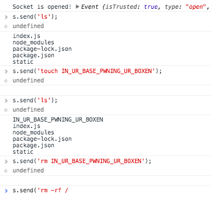

Gaping Security Hole: How Not to Use WebSockets
===============================================

The first thing to do with websockets is of course to give someone the ability to execute arbitrary shell commands.  You could do it over HTTP, but this is the future, we do it live, with WebSockets.
